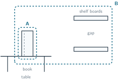
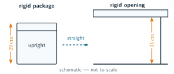

+++
order = 1
subject = "physics"
tags = ["physical-reasoning", "systems", "quantities", "measurement", "models"]
prerequisites = [
  "concept:mathematics/quantitative-reasoning-and-arithmetic#measurement-unit",
  "concept:mathematics/quantitative-reasoning-and-arithmetic#unit-conversion",
]
provides = [
  "system",
  "system-boundary",
  "surroundings",
  "physical-quantity",
  "quantity-value",
  "measurement",
  "measurand",
  "physical-model",
  "model-assumption",
  "model-prediction",
  "model-test",
]
+++

# Systems, quantities, and models

<!-- card-id: 331c8e40-ad49-4a4d-be8e-278136944105 -->
Q: To investigate a question, physicists choose a **system**: the part of the physical world being studied, such as an object, collection, or region. An imagined **system boundary** separates it from the **surroundings**, everything outside. If the system is a closed book on a table, is the table part of the system or the surroundings?
A: The surroundings. The chosen boundary encloses the book but not the table.

<!-- card-id: ae305306-c6bd-4fac-9156-93e61a10417b -->
Q: Each panel shows the same book and ruler. A dashed loop is a candidate system boundary. For the question “What is the height of the closed book?”, the book is the system and the ruler is **measuring apparatus**, a tool used to make the measurement, outside it.

Which candidate boundary, A or B, matches that choice?
A: Boundary A. It encloses the book while leaving the ruler in the surroundings as part of the measuring setup.

<!-- card-id: 92188945-eb15-4616-b861-d027dffe3502 -->
Q: Why can the system boundary around the same physical objects change when the question changes?
A: The system is chosen for the question, not discovered as a unique outline. Include the objects needed for the relationship being studied and treat the rest as surroundings.

<!-- card-id: 9460348f-15e2-456c-a12d-8d5a80003c21 -->
Q: A **property** is a feature of an object or event. A **physical quantity** is a property with a comparable size or amount that can be expressed using a number and a reference such as a unit. For one book, which is a physical quantity: its printed title or its height?
A: Its height. Heights can be compared and expressed with a number and a length unit; the printed title is descriptive but has no greater-or-smaller size or amount.

<!-- card-id: 63668add-14c0-4053-b2d6-d6289e30500b -->
Q: A book's height is a **physical quantity**. A **quantity value** expresses that quantity as a number and a reference, commonly a unit. In “the book's height is \(24\text{ cm}\),” what is the quantity and what is its value?
A: The quantity is that particular book's height; its expressed value is \(24\text{ cm}\). The number and unit together express the value.

<!-- card-id: bc57cea5-b063-4d46-bfb3-ca52e13f656a -->
Q: A **measurement** is an experimental process for obtaining a quantity value, usually by comparison with an agreed reference called a **unit**. What makes a ruler reading a measurement rather than an unsupported guess about length?
A: The ruler provides an experimental comparison with marked length units. The reading comes from that comparison, not from estimation alone.

<!-- card-id: 8c8d8039-ad8f-49ed-9a61-1d36dd20b61f -->
Q: The same strip has length \(0.30\text{ m}=30\text{ cm}\). What changed when meters were replaced by centimeters, and what stayed the same?
A: The unit and numerical value changed; the strip's physical length stayed the same. A smaller unit needs a larger number to express the same quantity.

<!-- card-id: 6567df8d-355f-41d0-8884-2c3a4c8f686e -->
Q: The **measurand** is the particular quantity intended to be measured. In the instruction “measure the height of this closed book while it lies flat on the table,” what is the measurand?
A: The height of that particular closed book while it lies flat on the table. The object, property, and relevant condition make the target specific.

<!-- card-id: ad58e313-35b3-4ec7-bd57-845f0d9c4269 -->
Q: An **observation** may be descriptive, while a measurement supplies a quantity value. After looking at a lid, a learner records “the lid is open.” After comparing an opening with a ruler, the learner records “the opening is \(18.2\text{ cm}\) high.” Which record is a measurement?
A: “The opening is \(18.2\text{ cm}\) high.” It reports a measured quantity value; “the lid is open” is a descriptive observation.

<!-- card-id: 9329ea57-dfc9-4c2e-8769-50381791815a -->
Q: A **physical model** is a purposeful, simplified representation of a system. Why can a plain rectangular outline be a useful model of a decorated storage box for an upright-fit question?
A: It keeps the outer height and width needed to judge fit and omits decorations that do not affect that question. A model is useful for a purpose; it need not copy every detail.

<!-- card-id: 570c3b2f-6325-458e-afbb-7154fa373040 -->
Q: For a real storage box and a rectangular drawing of it, which is the system and which is the model?
A: The real box is the physical system being studied; the drawing is a model that represents selected features of it.

<!-- card-id: deaf17e2-8247-4753-ac80-c29386a7df4c -->
Q: An **assumption** is a condition accepted while using a model. A box model treats the top and bottom as flat and the box as **rigid**, meaning it does not bend. What role do those statements play?
A: They are model assumptions. They state the conditions under which the simplified shape is being used.

<!-- card-id: 2c721ff4-1609-4005-b46b-e94d657fb57e -->
Q: Why can two different models of the same storage box both be useful—one keeping its outer height and width and another keeping its printed markings?
A: They answer different questions. Outer height and width matter for fit, while printed markings matter for identifying the box; relevance depends on purpose.

<!-- card-id: e6b842d4-e056-4f37-9cf0-c5e2f6043480 -->
Q: A **prediction** is an observable or measurable result expected if a model and its assumptions apply. A tray is modeled as \(3\) complete rows with \(4\) slots per row. What slot count does the model predict?
A: \(12\) slots. The model gives \(3\times4=12\) under the assumption that all three rows are complete.

<!-- card-id: 34569339-1243-464a-a07e-f63d78b89042 -->
Q: What makes a physical model testable?
A: It produces a prediction that can be compared with an observation or measurement. The comparison must be able to disagree with the prediction.

<!-- card-id: 0fc7fae4-0d38-49ed-8580-b8d1bdcdba21 -->
Q: A tray model predicts \(12\) usable slots, but observation finds \(11\). What is the strongest conclusion from this comparison alone?
A: The prediction does not match this tray. The mismatch is a reason to examine the model and its assumptions; by itself it does not identify every cause or make all uses of the model worthless.

<!-- card-id: 4cc509f7-525a-4eb0-b2c0-e0845f1b0622 -->
Q: The system for this question includes a rigid package and a rigid opening. The model assumes the package moves straight through while upright and predicts a fit when package height is less than opening height. Double-ended arrows mark the two measured heights. The **schematic** is a simplified drawing, and it is not to scale.

What does the model predict?
A: The package fits straight through while upright because \(29\text{ cm}<31\text{ cm}\). The prediction applies only under the stated rigid, upright, straight-through assumptions.

<!-- card-id: 6f021415-b7dc-46c9-8ff2-3c22f8ec388c -->
P: A rigid board is \(42\text{ cm}\) high. It must slide straight and upright through a rigid opening \(40\text{ cm}\) high, without tilting. Use the sequence question → system → quantity → model → prediction → check to decide what the stated model supports.
S: **IDENTIFY:** The system is the board and opening for the fit question. The relevant quantities are their heights.

**PLAN:** Use the stated straight-upright model: the board fits only if its height is less than the opening height.

**EXECUTE:** \(42\text{ cm}>40\text{ cm}\), so the model predicts that the board **does not fit** straight through while upright.

**EVALUATE:** The comparison direction is sensible: the board is \(2\text{ cm}\) taller. The conclusion does not cover tilting, bending, or changing the opening because those possibilities were excluded from the model.
