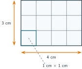

+++
order = 7
subject = "physics"
authoring_model = "claude-fable-5"
authoring_reasoning_effort = "high"
tags = ["physical-reasoning", "derived-quantities", "unit-algebra", "dimensions", "dimensional-consistency"]
prerequisites = ["chapter:06_proportional_reasoning_and_scaling"]
provides = [
  "derived-quantity",
  "derived-unit",
  "per-unit-rate-notation",
  "unit-cancellation",
  "proportionality-constant-unit",
  "density",
  "area-unit",
  "volume-unit",
  "milliliter-cubic-centimeter",
  "squared-unit-conversion",
  "dimension",
  "same-dimension-addition",
  "same-unit-different-quantity",
  "dimensional-consistency",
  "dimensional-check-limit",
]
+++

# Dimensions and derived quantities

## Building new quantities from old ones

<!-- card-id: a5f4fa18-2245-430a-8369-dc0e0691f990 -->
Q: The filling trials recorded pouring rates spelled out in words: "20 mL per second". Physicists build such new quantities from established ones by division or multiplication, and the unit is built by the *same* operation on the units: dividing a volume by a time gives a unit written with a slash, **mL/s**, read "milliliters per second". A quantity whose unit is built this way is called a **derived quantity**, and mL/s is a **derived unit**. A tap delivers 90 mL of water in 30 s. Form the pouring rate as a single quantity value written with a slash unit.
A: The rate is **3 mL/s** — divide the numbers, \(90 \div 30 = 3\), and divide the units, mL by s, in the same stroke. The slash records exactly how the new quantity was built: a volume shared out over a time. Nothing about the rate had to be measured directly; it is derived from two measurements that were.

<!-- card-id: 2f43ee87-4488-49ac-8c4d-233baef8b333 -->
Q: In a calculation, units obey the same algebra as numbers and variables: they multiply together, and a unit appearing both above and below a division bar cancels, just as equal factors cancel in a fraction. Water pours at 3 mL/s for 40 s. Compute the volume delivered, carrying the units through the arithmetic, and show what happens to the "s".
A: The volume is **120 mL**. Writing the units as factors, \(3\ \tfrac{\text{mL}}{\text{s}} \times 40\ \text{s} = 120\ \tfrac{\text{mL} \times \text{s}}{\text{s}}\), and the s above cancels the s below, leaving pure mL. The cancellation is the point: the unit of the answer is not chosen — it falls out of the algebra, and here it correctly comes out as a volume unit.

<!-- card-id: 8f622975-2848-4386-91f3-eb0c023f6730 -->
Q: A constant of proportionality is itself a derived quantity, so it carries a unit of its own. In one container, water depth was directly proportional to the volume added, with the measured row "200 mL added, depth 3.9 cm" giving the equation \(d = k\,V\). What unit must \(k\) carry, and what is its per-unit meaning here?
A: The unit **cm/mL** — dividing the depth by the volume gives \(3.9 \div 200 \approx 0.02\) cm/mL, the depth gained per milliliter added. That unit is forced by the equation: only (cm/mL) × mL can produce the cm on the left side. One boundary case: when the independent quantity is a bare count, like coins in \(m = 5.2\,n\), the count contributes no unit, so the constant carries the dependent quantity's unit alone — the 5.2 is in grams, and "per coin" is a reminder of its meaning rather than part of the unit.

<!-- card-id: 28db4d8d-8284-448f-816e-9c238aafb803 -->
Q: For a well-mixed liquid, total mass is directly proportional to volume: each milliliter carries the same mass as every other. The constant of proportionality — mass divided by volume, in g/mL — is called the liquid's **density**, and it belongs to the liquid itself rather than to any particular sample. Measurements of plain water give "50 mL, 50 g" and "250 mL, 250 g". Compute water's density with its unit, and state what stays fixed as the sample grows.
A: About **1.0 g/mL** — both rows give the same ratio, \(50 \div 50 = 250 \div 250 = 1.0\), as a direct proportion demands. What stays fixed is the density itself: sample mass and sample volume both grow, but every milliliter of water carries about 1.0 g no matter how large the sample. That is why density can identify a liquid while mass and volume alone cannot — they describe the sample, density describes the stuff.

## Squared and cubed units

<!-- card-id: 7cdaefaa-dcd4-4be9-ba34-db21ea1a5527 -->
Q: The amount of flat surface inside a shape is its **area**, measured by counting how many unit squares — squares 1 cm along each side — cover the shape exactly. The unit is written **cm²**, read "square centimeter", because it is built from cm × cm, a length times a length. The figure shows a rectangular tile covered by a grid of unit squares. Use the figure to find the tile's area, and explain why multiplying the two side lengths gives the same result, unit included.

A: The area is **12 cm²**. The grid is an array — 3 rows of 4 unit squares — so counting gives 12 squares of 1 cm² each. Multiplying the sides computes the same array count, and the units multiply along with the numbers: \(4\ \text{cm} \times 3\ \text{cm} = 12\ \text{cm}^2\), since cm × cm = cm². Area is a derived quantity: a length times a length, with a derived unit to match.

<!-- card-id: 5fb2cb23-09bb-46a2-8f40-f261a92da424 -->
Q: The amount of space something fills is its volume — already familiar from mL readings on a measuring container. For box-like shapes, volume can instead be counted in unit cubes, 1 cm along every edge, giving the unit **cm³**, "cubic centimeter", built from cm × cm × cm. The figure shows a rectangular box packed with unit cubes. Use the figure to find the box's volume, counting by layers, and confirm the count by multiplying the three edge lengths with their units.

A: The volume is **24 cm³**. The bottom layer is a 4 × 3 array of 12 cubes, and the box holds 2 such layers: 24 unit cubes. The product of the edges agrees, units and all: \(4\ \text{cm} \times 3\ \text{cm} \times 2\ \text{cm} = 24\ \text{cm}^3\), because cm × cm × cm = cm³. One quantity, volume, now has two established units — the liquid mL and the counted cm³.

<!-- card-id: 2cf3c11c-da28-4bae-bfc8-9a14758bff19 -->
Q: The mL read off a measuring container and the cm³ counted from cubes describe the same kind of quantity, so they must be related by a fixed conversion — and the SI makes it as clean as possible: a cube 1 cm along every edge holds *exactly* 1 mL, by definition. A juice carton is labeled 250 mL. Express its volume in cm³, and state what makes this particular conversion so effortless.
A: The carton holds **250 cm³**. Because 1 mL and 1 cm³ are defined to be exactly equal, converting is pure relabeling — the number does not change at all, unlike cm-to-m conversions where a factor of 100 intervenes. The two units exist for different measuring procedures — pouring against a scale versus multiplying measured edges — but they report the same quantity on the same footing.

<!-- card-id: bfafef57-a32e-431d-9fe4-b17ec27e2b66 -->
C: Exact volume-unit equivalence, by definition in the SI: 1 cm³ = [1 mL], so values move between the cube-counting unit and the liquid-measuring unit with no arithmetic at all.

<!-- card-id: 1a382369-36fb-4900-ac67-233a89fbc380 -->
Q: A student converts an area: "1 m equals 100 cm, so 1 m² equals 100 cm²." The figure shows a square 1 m along each side, with a single 1 cm unit square drawn near one corner. Work out how many 1 cm squares actually cover the big square, and repair the student's reasoning.

A: It takes **10 000** unit squares: each row along the bottom holds 100 of them, and there are 100 such rows, so \(100 \times 100 = 10\,000\), meaning 1 m² = 10 000 cm². The algebra says the same thing: \(1\ \text{m}^2 = (100\ \text{cm}) \times (100\ \text{cm}) = 100^2\ \text{cm}^2\). The student applied the length factor once, but cm² contains cm *twice*, so the conversion factor must come in twice. A cubed unit would need it three times.

## Units, quantities, and kinds

<!-- card-id: 8c1ff613-9294-42f1-9973-4df5ee74d307 -->
Q: Physicists call the *kind* of quantity being measured its **dimension**: length, mass, and time are dimensions, and derived quantities have derived dimensions — area's dimension is length × length. (This is a different use of the word from a drawing's "dimensions", which are its labeled lengths.) Among the three values 3 m, 300 cm, and 3 m², which two can be values of one and the same measurand, and why can no conversion factor ever connect the third to them?
A: **3 m and 300 cm** — the same length expressed in different units, so one measurand can carry both values. The third, 3 m², has dimension length × length, a different kind of quantity: conversion factors relate different units *within* one dimension, so no factor can turn meters into square meters. Before reaching for a conversion, check the dimension; only then does a unit change even make sense.

<!-- card-id: cb8b46a5-61a0-4c29-a079-4d284e8a7155 -->
Q: Two students compute: student A writes "1.2 m + 30 cm = 1.5", and student B writes "5 g + 20 mL = 25". One computation can be fixed; the other cannot be rescued at all — yet 5 g ÷ 20 mL earlier gave a perfectly good 0.25 g/mL. State which is which, and the rule that separates adding from dividing.
A: Student A's sum is **fixable**: both terms are lengths, so after converting to a shared unit, \(1.2\ \text{m} + 0.30\ \text{m} = 1.5\ \text{m}\). Student B's is **meaningless**: grams and milliliters belong to different dimensions, no conversion relates them, and "25" of nothing results. Adding or subtracting demands the *same dimension*, expressed in the same unit. Multiplication or division can combine different dimensions when a physical relationship defines a derived quantity — as mass divided by volume defines density — but matching unit algebra alone does not guarantee that an arbitrary combination is physically useful.

<!-- card-id: 5dcc4c1a-37a9-4c2c-9319-3d1a486ba5b6 -->
Q: A ruler's resolution is 1 mm, and a small seed's length is measured as 1 mm. A classmate concludes: "Same number, same unit — these are the same measurement." Both values are genuine, and both really are 1 mm. What is wrong with the conclusion?
A: They are values of **different quantities** — different measurands. One describes the *instrument* (the finest difference its scale can show), the other describes the *seed* (how long it is). Matching numbers and units make the values numerically comparable, but do not make them the same measurement or make every arithmetic operation meaningful: a quantity value answers a question, and these answer different questions. Same unit — even same dimension — never by itself establishes that two values report the same measurand.

## Checking equations by their units

<!-- card-id: ffae85cf-6154-47dc-9b79-f277c669b199 -->
Q: Units give a way to audit an equation before any experiment: replace every symbol by its unit, do the algebra, and compare the two sides — a correct physical equation must carry the **same unit on both sides**. A classmate half-remembers the filling relationship and writes "time to fill = volume × rate", with volume in mL and rate in mL/s. Run the unit check on this proposal and give the verdict.
A: **Rejected.** The right side has unit \(\text{mL} \times \tfrac{\text{mL}}{\text{s}} = \tfrac{\text{mL}^2}{\text{s}}\), while the left side must be a time in s — the sides disagree, so the equation cannot be right for any numbers at all. Dividing instead repairs it: mL ÷ (mL/s) flips the divisor, \(\text{mL} \times \tfrac{\text{s}}{\text{mL}} = \text{s}\), so "volume ÷ rate" at least survives the check. A single unit mismatch condemns an equation without a single measurement.

<!-- card-id: d6f8d365-a179-44e4-b662-d88f8255febd -->
Q: For the filling situation, the proposals \(t = V \div r\) and \(t = 2V \div r\) *both* pass the unit check — each right side works out to seconds. What exactly can a unit check settle about a proposed equation, and what must always be settled some other way?
A: A unit check can only **reject** — it can never confirm. Pure numbers such as the 2 carry no unit, so they are invisible to the check: every multiplied-in factor, right or wrong, passes untouched. Failing the check proves an equation impossible; passing it proves nothing beyond "not obviously impossible", and deciding *which* consistent equation is true is the job of measured data. The check is a fast filter to run first, not a substitute for evidence.

## Problems

<!-- card-id: 5f9c20ca-6655-4fd8-95b6-04b1c93dae9f -->
P: An empty container placed on a balance reads 84 g. With a liquid poured in, the balance reads 176 g, and the liquid's volume reads 100 mL on the container's scale. Find the liquid's density, with its unit — and decide whether the liquid could be plain water.

S: **IDENTIFY:** A derived-quantity construction: density is mass divided by volume, in g/mL. The liquid's mass is not read directly — it needs the two-reading method, subtracting the empty-container reading from the loaded one. The final decision compares the result with water's known density of about 1.0 g/mL.

**PLAN:** Subtract the balance readings to isolate the liquid's mass; divide that mass by the measured volume, carrying the units so the derived unit emerges; compare the value with 1.0 g/mL, allowing for ordinary reading wobble.

**EXECUTE:** The density is **0.92 g/mL**, and the liquid is **not plain water**. The liquid's mass is \(176 - 84 = 92\) g — the container's own 84 g must not be charged to the liquid. Dividing, \(92\ \text{g} \div 100\ \text{mL} = 0.92\) g/mL. Water sits at about 1.0 g/mL, and 0.92 falls well outside reading wobble of that value; the liquid is something lighter per milliliter, such as a cooking oil.

**EVALUATE:** The unit fell out correctly — g ÷ mL = g/mL, a mass per volume, as density must be. The subtraction passes an inverse check: \(84 + 92 = 176\). And the verdict is honest about resolution: the balance reads to 1 g and the scale to a few mL, which could shift the ratio by a few hundredths at most — far too little to stretch 0.92 up to 1.0.

<!-- card-id: f63a4faa-8bee-47e4-9ee6-bd4689367276 -->
P: A dripping tap leaks water at 2.5 mL/min. How much volume does it lose in 1.5 h? Carry the units through every step.

S: **IDENTIFY:** A rate-times-time computation whose time units disagree — the rate is per minute, the duration in hours — so a conversion must come first.

**PLAN:** Convert 1.5 h to minutes, then multiply by the rate, letting the units cancel.

**EXECUTE:** The tap loses **225 mL**. Converting, \(1.5\ \text{h} \times 60\ \tfrac{\text{min}}{\text{h}} = 90\ \text{min}\) — the h cancels. Then \(90\ \text{min} \times 2.5\ \tfrac{\text{mL}}{\text{min}} = 225\ \text{mL}\) — the min cancels, leaving a pure volume unit.

**EVALUATE:** Both cancellations ended in mL, the unit a volume answer must carry; skipping the conversion would have left a meaningless mL·h/min. The size is believable: about a quarter of a liter, a drinking-glass amount, for an hour and a half of steady dripping.

<!-- card-id: 5948b0fd-51df-4933-b4f1-33ce4b4f5b36 -->
P: Three half-remembered candidates for the time \(t\) to fill a container, where \(V\) is the container's volume in mL and \(r\) the pouring rate in mL/s: (i) \(t = V \times r\); (ii) \(t = r \div V\); (iii) \(t = V \div r\). Use unit checks to eliminate candidates, state what survives, and state what surviving does and does not establish.

S: **IDENTIFY:** An equation audit by dimensional consistency: each candidate's right-side unit must be worked out by unit algebra and compared with the s that a time demands.

**PLAN:** Substitute mL and mL/s into each candidate, simplify with cancellation — flipping the divisor where the algebra divides by a fraction — and keep only candidates whose right side lands on s.

**EXECUTE:** Only candidate **(iii)** survives. For (i), \(\text{mL} \times \tfrac{\text{mL}}{\text{s}} = \tfrac{\text{mL}^2}{\text{s}}\) — not a time; rejected. For (ii), \(\tfrac{\text{mL}}{\text{s}} \div \text{mL} = \tfrac{1}{\text{s}}\) — a per-second value, not a time; rejected. For (iii), \(\text{mL} \div \tfrac{\text{mL}}{\text{s}} = \text{mL} \times \tfrac{\text{s}}{\text{mL}} = \text{s}\) — consistent.

**EVALUATE:** Surviving establishes only that (iii) is *possible*: the check cannot confirm, since any unitless factor would pass equally well. Independent support comes from the measured filling trials, where rate times time reproduced the fixed 600 mL — for instance 20 mL/s × 30 s — which is exactly (iii) rearranged. Passing plus matching data is a far stronger position than passing alone.

<!-- card-id: 348f721e-3034-413f-bd36-7f6cb4434259 -->
P: A container with constant cross-sectional area is filled in steps, with two measured rows: 100 mL added gives depth 2.5 cm; 200 mL added gives depth 5.0 cm. Three written claims about the depth \(d\) for volume \(V\):

Claim (i): \(d = 0.025\,V\), "where 0.025 is just a pure number".

Claim (ii): \(d = 0.025\,V\), where the constant carries the unit cm/mL.

Claim (iii): \(d = 0.015\,V + 1.0\), with the constant in cm/mL and the 1.0 in cm.

Audit all three: reject what a unit check alone can reject, use the data to decide among the survivors, and state the general lesson about what each kind of check contributes.

S: **IDENTIFY:** A two-stage audit: first dimensional consistency, which needs no data, then a data test — ratio constancy and the doubling check — to choose among dimensionally consistent rivals.

**PLAN:** Check each claim's units, remembering that a pure number contributes none; then test the surviving claims against both measured rows, not just one.

**EXECUTE:** Only claim **(ii)** survives both stages. Claim (i) fails the unit check outright: with a pure-number constant, the right side keeps the unit mL while the left side is in cm — impossible, whatever the numbers. Claims (ii) and (iii) both pass: each right side works out to cm. The data then separate them. Doubling the volume from 100 to 200 mL doubles the depth from 2.5 to 5.0 cm, the fingerprint of direct proportion, and claim (ii) predicts both rows: \(0.025 \times 100 = 2.5\) and \(0.025 \times 200 = 5.0\). Claim (iii) matches the first row — \(0.015 \times 100 + 1.0 = 2.5\) — but fails the second, predicting \(0.015 \times 200 + 1.0 = 4.0\) cm against the measured 5.0.

**EVALUATE:** Claim (iii) is the cautionary tale: dimensionally consistent *and* correct at one data point, yet wrong — one matching row is weak evidence, and its 1.0 cm starting depth also contradicts an empty constant-cross-section container holding zero water at zero depth. The division of labor stands: unit checks reject impossible forms for free; only data can pick the true equation from the consistent survivors.
