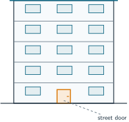

+++
order = 8
subject = "physics"
authoring_model = "claude-fable-5"
authoring_reasoning_effort = "high"
tags = ["physical-reasoning", "estimation", "order-of-magnitude", "reference-values", "bounds"]
prerequisites = ["chapter:07_dimensions_and_derived_quantities"]
provides = [
  "estimate",
  "reference-value",
  "estimate-decomposition",
  "power-of-ten-form",
  "order-of-magnitude",
  "order-of-magnitude-comparison",
  "estimate-bounds",
  "bound-propagation",
  "estimate-for-decision",
  "estimate-precision-reporting",
  "estimate-assumption-reporting",
  "order-of-magnitude-audit",
]
+++

# Estimation and order of magnitude

## Estimates and reference values

<!-- card-id: a088444e-519f-4df2-9bcd-57a064699d1d -->
Q: Two coworkers, carrying no tape measure, state the length of the same corridor. Pia: "About 6 m — it is three doors laid end to end, and a door is about 2 m tall." Quinn: "About 6 m — it just feels like 6." An **estimate** is a deliberately rough quantity value built by comparing the target with a **reference value** — an amount you already know, such as that 2 m door. Both reports say 6 m, so what makes one of them more useful than the other?
A: Pia's report can be **checked, challenged, and improved** — anyone can recount the door-lengths or question the 2 m reference, and a better door value immediately gives a better corridor value. Quinn's feeling offers nothing to check: if the two disagreed, there would be no way to find out why. An estimate earns trust from its visible comparison with a reference value, not from the number it happens to produce.

<!-- card-id: d618c3e6-300c-4732-8585-824530efd3c9 -->
Q: The figure shows a building with five equal floors and its street door at ground level. No lengths are labeled — but an ordinary door is about 2 m tall, and that reference value plus the drawing's proportions is enough. Estimate the building's height, stating the comparison you used.

A: About **15 m** — in the drawing each floor band stands about one and a half door-heights tall, so a floor is roughly \(1.5 \times 2 = 3\) m, and five floors give \(5 \times 3 = 15\) m. Any value near this from a stated comparison is sound; the skill is reading a countable structure (five floors) and a reference (the door) out of the scene, then scaling.

## Decomposing an estimate

<!-- card-id: 9bbf1bbc-8b80-413c-90ee-a33e7fc1a74e -->
Q: Nobody can estimate "how many sheets of paper are in a 2.0 m tall stack" by staring at it — but the estimate can be **decomposed**: broken into a product of factors that each *can* be anchored. A 500-sheet pack of paper is about 5 cm thick. Build the factor chain with its units and compute the sheet count.
A: About **20 000 sheets**. The pack anchors a per-unit value: \(500 \div 5 = 100\) sheets/cm. The stack is \(2.0\ \text{m} = 200\ \text{cm}\), so \(200\ \text{cm} \times 100\ \tfrac{\text{sheets}}{\text{cm}} = 20\,000\) sheets — the cm cancels, exactly as unit algebra requires. Decomposition converts one impossible judgment into two easy ones: a length anyone can measure and a reference value printed on the pack.

<!-- card-id: ccfd043b-5282-460f-8235-130697c0dad5 -->
Q: A large jar of mixed coins is to be estimated: how many coins does it hold? Two proposed decompositions — A: (the jar's volume) ÷ (the space one coin takes up, gaps included), each factor obtainable with a measuring container. B: (the total value of the money in the jar) ÷ (the value of a typical coin). Which decomposition can actually be carried out, and what rule does the other one break?
A: Decomposition **A** works: estimate the jar's usable volume, then place a counted sample of coins into a narrow measuring container, read the bulk volume they occupy **with their gaps**, and divide by the sample count. Decomposition B breaks the rule that **every factor must be easier to anchor than the original target**: the jar's total value is exactly as unknown as its coin count, so B merely renames the problem instead of decomposing it. Water displacement would not supply A's needed factor because it measures only the coins' solid material, not the gaps in a poured pile.

## Powers of ten and order of magnitude

<!-- card-id: 4e8566f7-9f86-4998-998d-7900dfcbad36 -->
Q: A rough estimate often deserves only its **leading digit** — the first digit — and a count of how many tens follow. Powers collect the tens: \(10^3 = 10 \times 10 \times 10 = 1000\), so a number like 300 000 is written compactly as \(3 \times 10^5\), the leading digit times a power of ten. Translate both ways: write 20 000 in leading-digit form, and expand \(7 \times 10^3\) into an ordinary number.
A: The forms are \(20\,000 = \mathbf{2 \times 10^4}\) (a 2 followed by four zeros) and \(7 \times 10^3 = \mathbf{7000}\). The exponent simply counts the zeros after the leading digit, so the form carries exactly what a rough value honestly knows — its first digit and its size — and nothing more.

<!-- card-id: cb2c186a-cbdb-4d8e-a44f-5fbbe17645b1 -->
Q: A value's **order of magnitude** is the power of ten nearest to it — nearest as a *factor*, not by subtraction. On the factor scale, 3 sits near the middle between 1 and 10, because two steps of ×3 make roughly one step of ×10 (\(3 \times 3 = 9 \approx 10\)): leading digits up to about 3 round down to the power below, larger ones round up. Give the order of magnitude of 200 and of 40 000.
A: They are \(\mathbf{10^2}\) and \(\mathbf{10^5}\). For 200 = \(2 \times 10^2\), the leading 2 is under 3, so the order stays at \(10^2\). For 40 000 = \(4 \times 10^4\), the leading 4 is past the ×3 midpoint — 40 000 is a factor 4 above \(10^4\) but only a factor 2.5 below \(10^5\) — so its order is \(10^5\). Values with a leading digit near 3 are judgment calls, and that is fine at this roughness.

<!-- card-id: f43d46e4-5584-400b-89ea-d7c4f8d4c884 -->
Q: The figure shows a ladder of sizes in which every step up multiplies by 10 — one order of magnitude per rung — with familiar objects pinned to their rungs. Equal spacing is honest here precisely because each step means the same *factor*. Using the ladder, state how many orders of magnitude separate the width of a fingernail from the length of a city block, and what multiplying factor that count stands for.

A: They sit **4 orders of magnitude** apart — counting rungs from 1 cm up through 10 cm, 1 m, and 10 m to 100 m is four steps, a factor of \(10^4 = 10\,000\). The check agrees without the ladder: \(100\ \text{m} = 10\,000\ \text{cm}\). "Differs by \(n\) orders of magnitude" always means "about \(10^n\) times", never a difference by subtraction.

## Bounding an estimate

<!-- card-id: ba3f6d9d-189a-4d42-a856-9b6169d17f64 -->
Q: A single estimated number hides how sure you are. Estimators therefore attach a **lower bound** and an **upper bound** — a "certainly at least" and a "certainly at most" value, each backed by its own reference comparison — bracketing the truth between them. Give a defensible bracket for the length of a family car, naming the comparison behind each bound.
A: Something like **at least 3 m, at most 6 m**: a car is clearly longer than one 2 m door laid down plus a little more, and clearly shorter than three doors laid end to end. The exact numbers matter less than the rule: each bound must lean on a comparison you would defend, so a wide-but-sure bracket beats a narrow one you merely hope for. (Repeated readings gave measurements an uncertainty interval; a bracket plays that role for an estimate, with judgment replacing the instrument.)

<!-- card-id: fb2287d2-1254-45b4-a72f-e0abbb7c87a8 -->
Q: Before a corridor was taped, two students bracketed its length: the figure shows bracket A, bracket B, and the tape-measure result that arrived afterwards. What does this outcome show about each student's bounds?

A: Student A's bracket **failed**: 6.9 m lies outside 5.8–6.2 m, so A's "certainly between" was overconfidence — the bounds claimed more sureness than A's references could support. Student B's wide 4–8 m bracket **did its job**: the truth landed inside. A bracket is a claim that reality can defeat, like any prediction; narrowness is a virtue only while the bounds stay honestly defensible.

<!-- card-id: 4d578206-a253-4a38-bded-c49e8ac19f4c -->
Q: Bounds can be pushed through a decomposition: for a product of positive factors, the smallest total comes from multiplying the lower bounds together, the largest from multiplying the upper bounds. The paper-stack estimate had bracketed factors: height between 180 and 220 cm, and between 80 and 120 sheets/cm. Compute the bracket for the total sheet count and state it at honest roughness.
A: Between about **14 000 and 26 000 sheets**: lows \(180 \times 80 = 14\,400\), highs \(220 \times 120 = 26\,400\), rounded to their leading digits. Note how the bracket fattened: each factor was uncertain by roughly ±10–20%, and multiplying let the two uncertainties compound. Both ends still share the order \(10^4\), which is often all an estimate needs to hold onto.

<!-- card-id: f6a9d5c3-7c11-4a63-b75a-8a3dec147af4 -->
Q: Eighteen moving boxes each need one strip of tape — about 20 cm, certainly between 15 and 25 cm. One roll holds 5 m of tape. Using bounds alone, decide whether one roll is enough, and state the general rule for when an estimate needs no further sharpening.
A: **One roll is enough** — even at the upper bound, \(18 \times 25\ \text{cm} = 450\ \text{cm} = 4.5\ \text{m}\), still under 5 m; the lower bound, \(18 \times 15 = 270\) cm, is under too. When *both* bounds land on the same side of the decision line, the decision is already settled, and sharpening the estimate — or measuring — would change nothing. Only a bracket straddling the line calls for finer work.

## Reporting estimates honestly

<!-- card-id: d636832d-f09d-4dd0-87e0-2569eb107bae -->
Q: A student estimates how many sticky notes would cover a corridor wall. She judges the wall by eye as 6.0 m by 2.5 m, so \(15\ \text{m}^2 = 150\,000\ \text{cm}^2\); she recalls a note as 7 cm × 7 cm, so 49 cm² each. Her calculator shows \(150\,000 \div 49 = 3061.224...\), and she reports "3 061.224 notes". Diagnose the report and rewrite it honestly.
A: Report **about 3 × 10³ notes — three thousand**. The inputs were eye-judged and recalled, rough at best to one digit, and a computation can never add knowledge its inputs lacked — every digit after the leading 3 is noise, the same false precision that plagues over-written measurement results. (The .224 of a note also claims a fraction of an indivisible thing, a giveaway that the digits were copied, not thought.)

<!-- card-id: c4aab7b0-ded4-4130-962f-db0b1adab651 -->
Q: Two versions of that sticky-note result are pinned to the notice board. Version 1: "Notes needed: about 3 000." Version 2: "Notes needed: about 3 000 — assuming the wall is about 6 m × 2.5 m and one note covers about 50 cm²." For the next person who reads the board, what does version 2 provide that version 1 cannot?
A: Version 2 can be **checked, corrected, and reused**: a reader who distrusts the result can test each stated assumption separately — re-pace the wall, measure one note — replace the bad input, and see exactly how the answer shifts. Version 1 can only be believed or ignored. An estimate is a small model of the situation, and like any model its assumptions are part of the result, not private scaffolding.

<!-- card-id: 27227de5-4e8b-4e31-bb9e-d16bda053f53 -->
Q: A flyer claims a rainwater barrel "about the size of a bathtub" holds 20 000 L. Audit the claim with an order-of-magnitude comparison, and state what such an audit could and could not have established had the claim instead said 300 L.
A: **Rejected**: a bathtub holds about 200 L, and \(20\,000 \div 200 = 100\) — the claim sits two orders of magnitude above its own size description, far beyond any wobble in the 200 L reference. A 300 L claim, though, is within a factor of about 2 of the reference, so the audit could *not* rule it out — and could not certify it either. Like a unit check, an order-of-magnitude audit can only reject; confirming an exact value takes an actual measurement.

## Problems

<!-- card-id: cdeea98c-99a0-4458-85d8-6da7717bb930 -->
P: Estimate the mass of the water that fills a bathtub, in kilograms, with a defensible bracket. No balance could weigh it directly.

S: **IDENTIFY:** A decomposition estimate: the mass cannot be anchored in one step, but mass = volume × density, and both factors are reachable — a bathtub's capacity has a familiar reference value, and water's density is an established 1.0 g/mL.

**PLAN:** Take the bathtub as about 200 L (a couple hundred 1 L bottles), bracketed 150–300 L to be safe; convert litres to mL so the density's unit applies; multiply by 1.0 g/mL; convert grams to kilograms; carry the bracket through the same chain.

**EXECUTE:** About **200 kg**, with a bracket of roughly **150 to 300 kg**. Central value: \(200\ \text{L} = 200\,000\ \text{mL}\), then \(200\,000\ \text{mL} \times 1.0\ \tfrac{\text{g}}{\text{mL}} = 200\,000\ \text{g} = 200\ \text{kg}\) — the mL cancels, leaving mass. The bracket rides the volume bracket: 150 L gives 150 kg, 300 L gives 300 kg. In leading-digit form, about \(2 \times 10^2\) kg.

**EVALUATE:** The units worked without being forced: mL × g/mL = g, a mass. A shortcut confirms the central estimate: 1 L of water is about 1000 mL × 1.0 g/mL = 1000 g = 1 kg, so about 200 L gives about 200 kg by the same reasoning. The assumptions — tub size taken from the everyday benchmark, plain water rather than a heavier or lighter liquid — are stated, so a reader can swap either one and rerun the chain.

<!-- card-id: 8723a14c-453b-4d42-8285-fc9e12c53a54 -->
P: Counting your own calm breathing for one minute is a quick measurement anyone can make; suppose it gives about 15 breaths. Estimate how many breaths you take in one day, reported at honest roughness.

S: **IDENTIFY:** A decomposition estimate — breaths per day = (breaths per minute) × (minutes per day) — with the first factor anchored by a one-minute count.

**PLAN:** Compute minutes per day from the time units, multiply by the rate, then trim the result to leading-digit form.

**EXECUTE:** About \(\mathbf{2 \times 10^4}\) breaths — twenty thousand. Minutes per day: \(24 \times 60 = 1440\) min. Then \(1440\ \text{min} \times 15\ \tfrac{\text{breaths}}{\text{min}} = 21\,600\), and the min cancels. The one-minute count was rough, so 21 600 trims honestly to about 20 000.

**EVALUATE:** A bracket confirms the order: calm breathing plausibly ranges over 12–18 breaths/min, giving 17 000–26 000 — both ends still order \(10^4\). Sanity at the extremes: \(10^3\) breaths a day would mean under one breath per minute, and \(10^6\) would mean about 700 per minute; both are absurd, so \(10^4\) stands.

<!-- card-id: c7d15e28-8465-4bdb-98a0-53aefc34b85d -->
P: A school library must shelve 300 books of ordinary size. Estimate the total length of shelving needed, in meters, with a bracket and a stated reference. (For scale: a fingernail is about 1 cm across, and a typical book is a few fingernails thick.)

S: **IDENTIFY:** A decomposition estimate: shelf length = (number of books) × (thickness per book). The count is given exactly; the thickness needs a chosen reference value with a bracket.

**PLAN:** Anchor a book's thickness from the fingernail reference — about 3 cm, certainly between 2 and 5 cm. Multiply by 300, convert to meters, and push the bracket through the product.

**EXECUTE:** About **9 m of shelving, bracketed 6 to 15 m**. Central value: \(300\ \text{books} \times 3\ \tfrac{\text{cm}}{\text{book}} = 900\ \text{cm} = 9\ \text{m}\); the book label cancels and length remains. Bounds: \(300 \times 2 = 600\) cm and \(300 \times 5 = 1500\) cm, i.e. 6 m to 15 m. In leading-digit form, about \(1 \times 10^1\) m.

**EVALUATE:** An inverse route agrees: one meter of shelf holds \(100 \div 3 \approx 33\) books, so 300 books need about 10 shelf-meters — consistent. The bracket is wide, and honestly so: book thickness genuinely varies. If the library had exactly 9 m of wall available, the straddling bracket would demand better input — measure a real sample shelf of books — before promising a fit.

<!-- card-id: ad21c68d-f663-42e4-bde4-66749efdef47 -->
P: Two students estimate the number of words in a 300-page novel. Student A opens one page: about 10 words per line and about 30 lines per page, so \(10 \times 30 \times 300 = 90\,000\). Student B: "Novels are big — call it a million words." Express both estimates in leading-digit form, state how many orders of magnitude apart they sit, decide which deserves trust and why, and give a final verdict.

S: **IDENTIFY:** A comparison of two estimation strategies for one quantity: an anchored decomposition against an unanchored round number. The tools are leading-digit form, order-of-magnitude comparison, and the defensibility test — can each input be checked?

**PLAN:** Write both values as leading digit × power of ten; assign orders of magnitude; compare the two by factor; then judge each strategy by whether its inputs offer anything to verify.

**EXECUTE:** Trust student A: the verdict is about \(\mathbf{10^5}\) **words**. A's value is \(9 \times 10^4\), whose leading 9 rounds its order up to \(10^5\); B's is \(1 \times 10^6\), order \(10^6\). They disagree by about one order of magnitude — \(10^6 \div (9 \times 10^4) \approx 11\), roughly ten times. A's three factors can each be checked on any open page in seconds; B's "a million" leans on nothing, so when the two conflict there is no repair to attempt on B — it is simply set aside.

**EVALUATE:** A's result is robust: even generous inputs, \(12 \times 35 \times 300 = 126\,000\), stay at order \(10^5\), since a leading 1.26 rounds down; reaching \(10^6\) would need every factor to be badly underestimated at once. And the audit cuts one way only — A's anchored \(10^5\) rejects B's \(10^6\), but confirming any exact word count would take an actual count, not an estimate.
